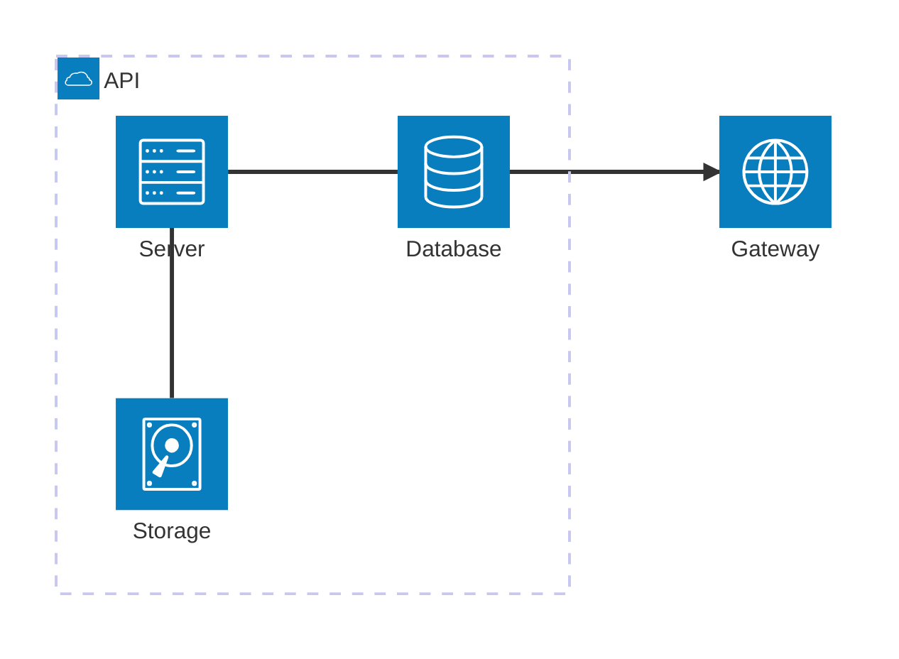

[Syntax Ref]: https://mermaid.ai/open-source/syntax/architecture.html

# Architecture

```mermaid
architecture-beta
group api(cloud)[API]

service db(database)[Database] in api
service disk1(disk)[Storage] in api
service server(server)[Server] in api
service gateway(internet)[Gateway]

db:L -- R:server
disk1:T -- B:server
db:R --> L:gateway
```
