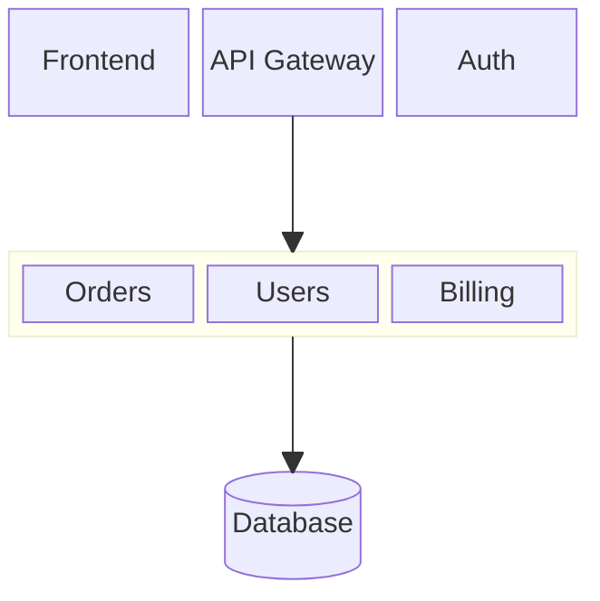

[Syntax Ref]: https://mermaid.ai/open-source/syntax/block.html

# Block diagram

```mermaid
block-beta
columns 3
  a["Frontend"] b["API Gateway"] c["Auth"]
  space:3
  block:services:3
    columns 3
    orders["Orders"] users["Users"] billing["Billing"]
  end
  space:3
  db[("Database")]:3
  b --> services
  services --> db
```
