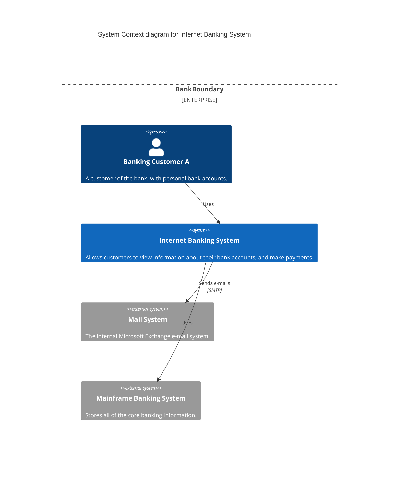
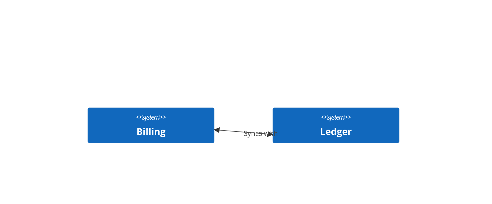

[Syntax Ref]: https://mermaid.ai/open-source/syntax/c4.html

# C4 Context diagram

```mermaid
C4Context
title System Context diagram for Internet Banking System
Enterprise_Boundary(b0, "BankBoundary") {
  Person(customerA, "Banking Customer A", "A customer of the bank, with personal bank accounts.")
  System(SystemAA, "Internet Banking System", "Allows customers to view information about their bank accounts, and make payments.")
  System_Ext(SystemE, "Mail System", "The internal Microsoft Exchange e-mail system.")
  System_Ext(SystemC, "Mainframe Banking System", "Stores all of the core banking information.")
}
Rel(customerA, SystemAA, "Uses")
Rel(SystemAA, SystemE, "Sends e-mails", "SMTP")
Rel(SystemAA, SystemC, "Uses")
```

A bidirectional relationship gets an arrowhead at both ends.

```mermaid
C4Context
System(billing, "Billing")
System(ledger, "Ledger")
BiRel(billing, ledger, "Syncs with")
```
