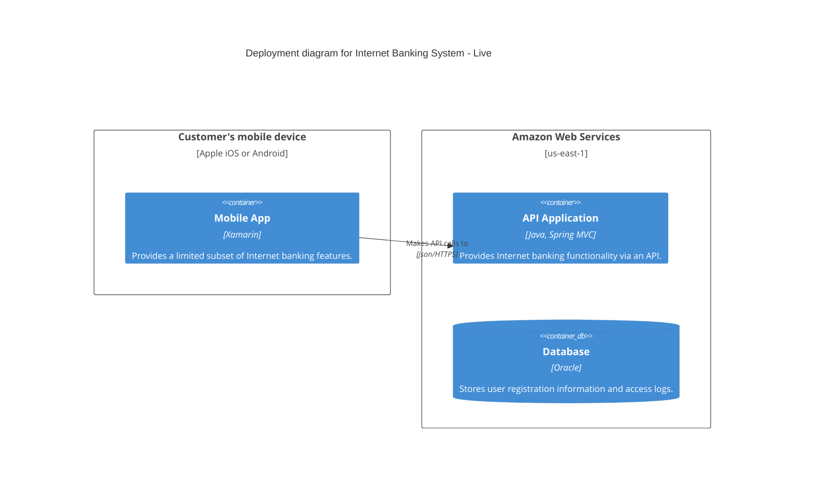

[Syntax Ref]: https://mermaid.ai/open-source/syntax/c4.html

# C4 Deployment diagram

```mermaid
C4Deployment
title Deployment diagram for Internet Banking System - Live
Deployment_Node(mobile, "Customer's mobile device", "Apple iOS or Android") {
  Container(mobile_app, "Mobile App", "Xamarin", "Provides a limited subset of Internet banking features.")
}
Deployment_Node(aws, "Amazon Web Services", "us-east-1") {
  Container(api, "API Application", "Java, Spring MVC", "Provides Internet banking functionality via an API.")
  ContainerDb(database, "Database", "Oracle", "Stores user registration information and access logs.")
}
Rel(mobile_app, api, "Makes API calls to", "json/HTTPS")
```
