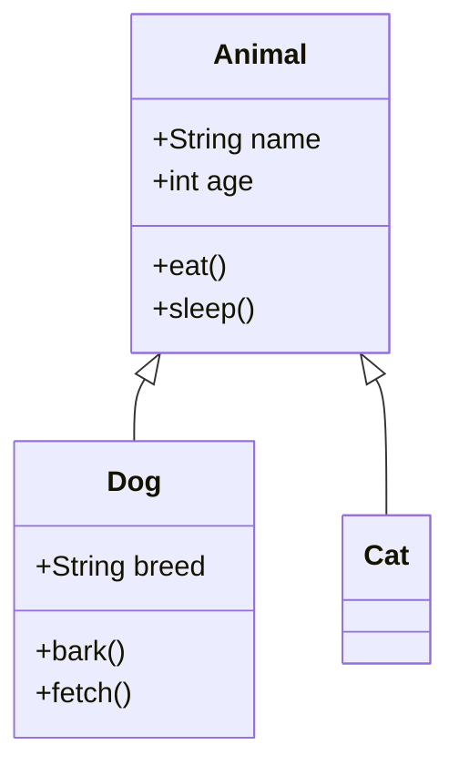

[Syntax Ref]: https://mermaid.ai/open-source/syntax/classDiagram.html

# Class diagram

```mermaid
classDiagram
class Animal {
  +String name
  +int age
  +eat()
  +sleep()
}
class Dog {
  +String breed
  +bark()
}
Animal <|-- Dog
Animal <|-- Cat
Dog : +fetch()
```
