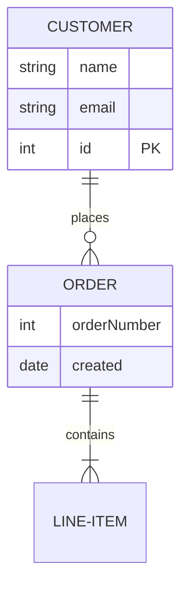

[Syntax Ref]: https://mermaid.ai/open-source/syntax/entityRelationshipDiagram.html

# Entity-relationship diagram

```mermaid
erDiagram
CUSTOMER ||--o{ ORDER : places
ORDER ||--|{ LINE-ITEM : contains
CUSTOMER {
  string name
  string email
  int id PK
}
ORDER {
  int orderNumber
  date created
}
```
