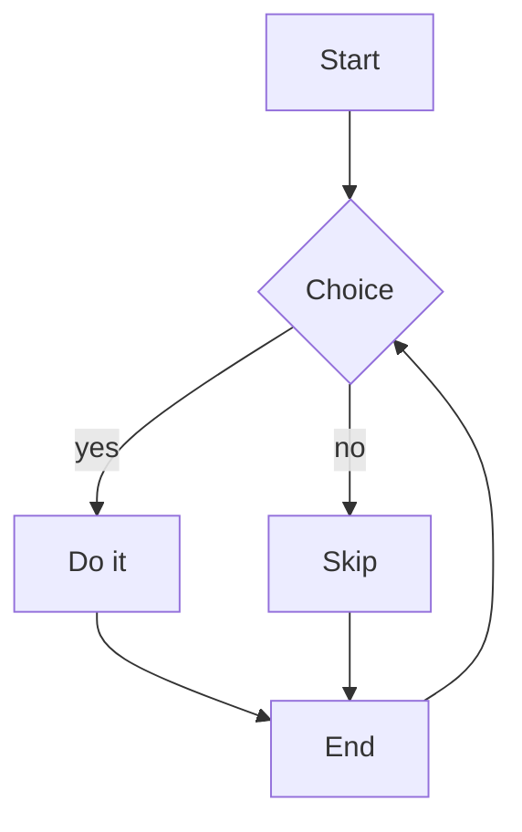
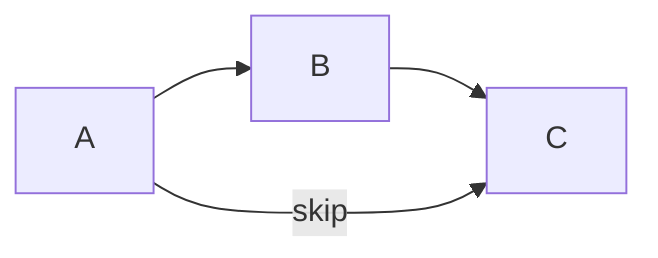
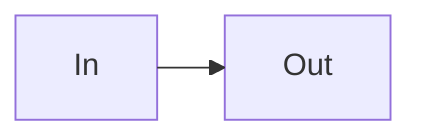

[Syntax Ref]: https://mermaid.ai/open-source/syntax/flowchart.html

# Flowchart

A decision flow with a branch, a join, and a back edge.

Left-to-right with a long edge that skips a rank.

The `flowchart-elk` header is an alias (the ELK layout hint is ignored).

