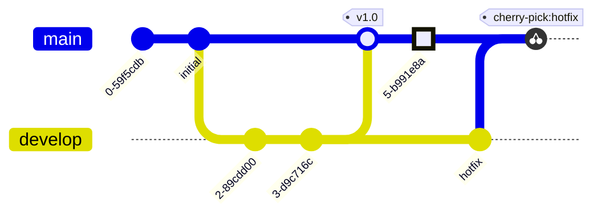

[Syntax Ref]: https://mermaid.ai/open-source/syntax/gitgraph.html

# Git graph

```mermaid
gitGraph
commit
commit id: "initial"
branch develop
checkout develop
commit
commit
checkout main
merge develop tag: "v1.0"
commit type: HIGHLIGHT
checkout develop
commit id: "hotfix"
checkout main
cherry-pick id: "hotfix"
```
