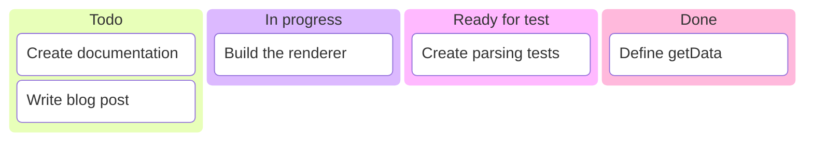

[Syntax Ref]: https://mermaid.ai/open-source/syntax/kanban.html

# Kanban board

```mermaid
kanban
  Todo
    [Create documentation]
    docs[Write blog post]
  id1[In progress]
    id6[Build the renderer]
  id2[Ready for test]
    id4[Create parsing tests]
  Done
    id5[Define getData]
```
