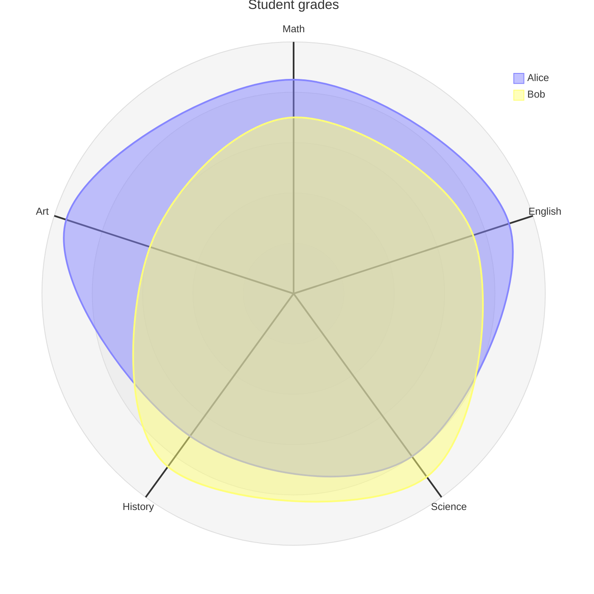

[Syntax Ref]: https://mermaid.ai/open-source/syntax/radar.html

# Radar diagram

```mermaid
radar-beta
title Student grades
axis math["Math"], eng["English"], sci["Science"], hist["History"], art["Art"]
curve a["Alice"]{85, 90, 80, 70, 95}
curve b["Bob"]{70, 75, 90, 85, 60}
max 100
min 0
```
