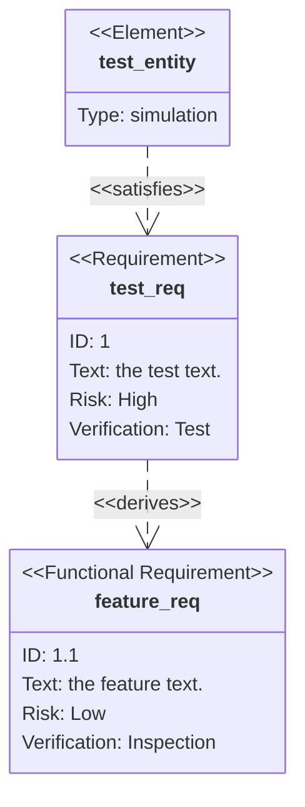

[Syntax Ref]: https://mermaid.ai/open-source/syntax/requirementDiagram.html

# Requirement diagram

```mermaid
requirementDiagram
requirement test_req {
  id: 1
  text: the test text.
  risk: high
  verifymethod: test
}
functionalRequirement feature_req {
  id: 1.1
  text: the feature text.
  risk: low
  verifymethod: inspection
}
element test_entity {
  type: simulation
}
test_entity - satisfies -> test_req
test_req - derives -> feature_req
```
