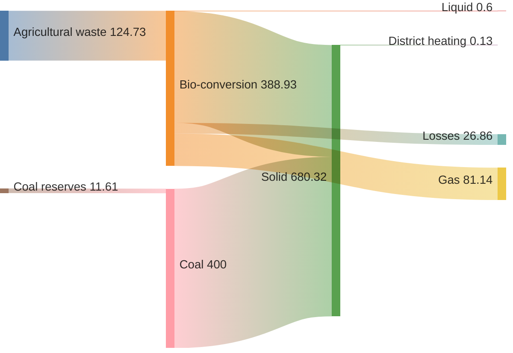

[Syntax Ref]: https://mermaid.ai/open-source/syntax/sankey.html

# Sankey diagram

```mermaid
sankey-beta
Agricultural waste,Bio-conversion,124.729
Bio-conversion,Liquid,0.597
Bio-conversion,Losses,26.862
Bio-conversion,Solid,280.322
Bio-conversion,Gas,81.144
Solid,District heating,0.129
Coal,Solid,400
Coal reserves,Coal,11.606
```
