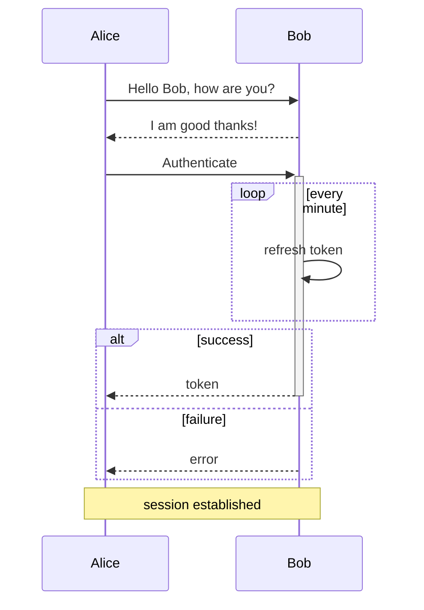

[Syntax Ref]: https://mermaid.ai/open-source/syntax/sequenceDiagram.html

# Sequence diagram

Messages, plus a `loop`/`alt` fragment, an activation bar and a note.

```mermaid
sequenceDiagram
participant A as Alice
participant B as Bob
A->>B: Hello Bob, how are you?
B-->>A: I am good thanks!
A->>+B: Authenticate
loop every minute
  B->>B: refresh token
end
alt success
  B-->>-A: token
else failure
  B-->>A: error
end
note over A,B: session established
```
