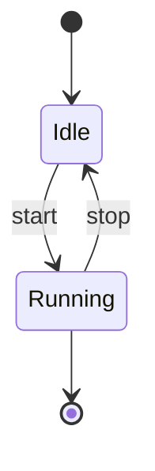
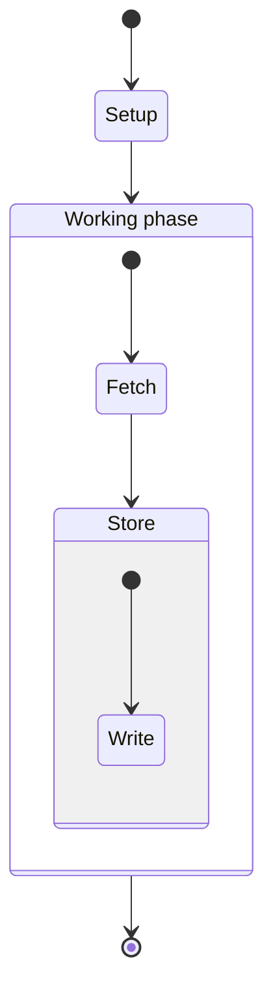

[Syntax Ref]: https://mermaid.ai/open-source/syntax/stateDiagram.html

# State diagram

Composite states draw as titled boxes; edges on a composite attach to its
scoped `[*]` start/end (or first member), and composites nest.

