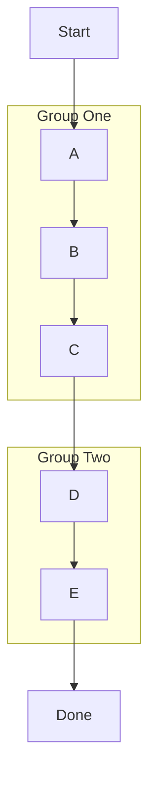

[Syntax Ref]: https://mermaid.ai/open-source/syntax/flowchart.html

# Flowchart subgraphs

```mermaid
flowchart TD
  Start --> A
  subgraph one [Group One]
    A --> B
    B --> C
  end
  subgraph two [Group Two]
    D --> E
  end
  C --> D
  E --> Done
```
