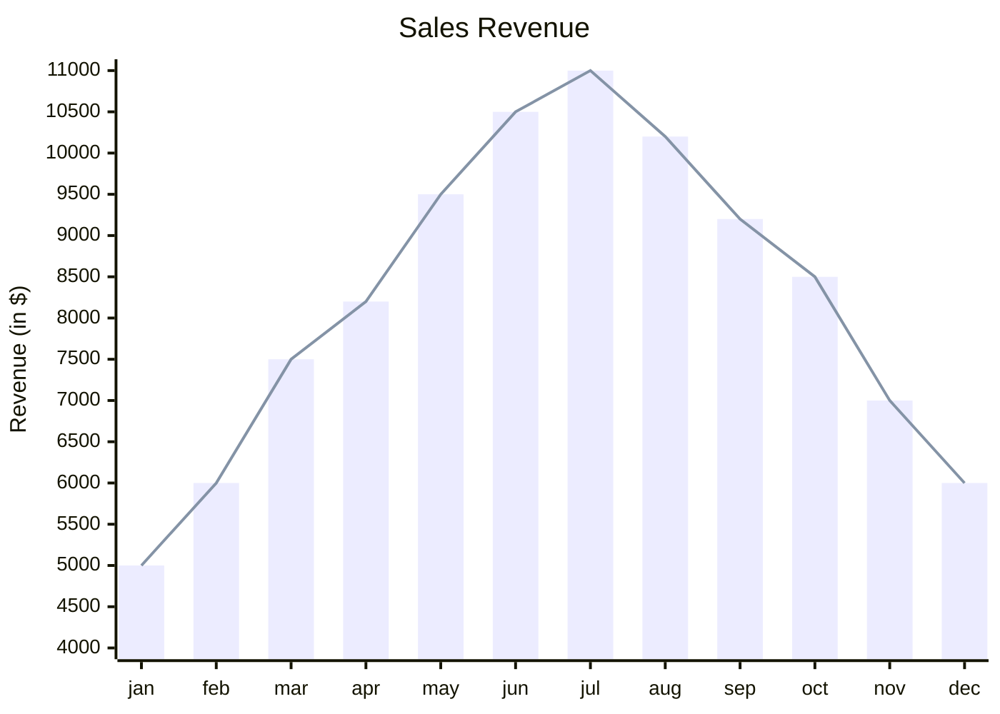
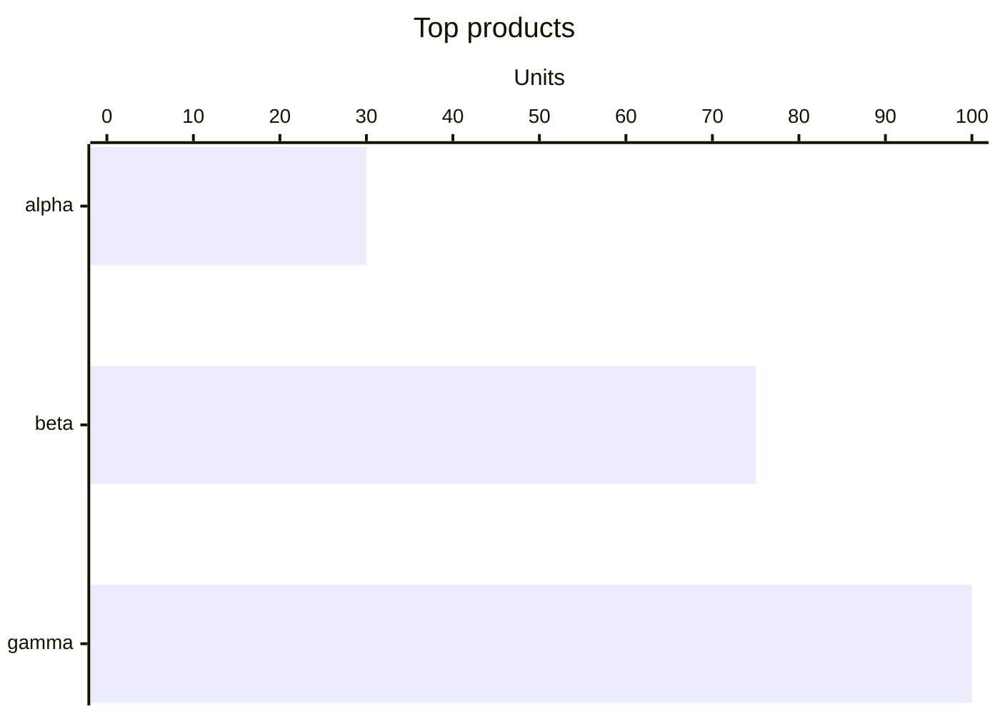

[Syntax Ref]: https://mermaid.ai/open-source/syntax/xyChart.html

# XY chart

```mermaid
xychart-beta
title "Sales Revenue"
x-axis [jan, feb, mar, apr, may, jun, jul, aug, sep, oct, nov, dec]
y-axis "Revenue (in $)" 4000 --> 11000
bar [5000, 6000, 7500, 8200, 9500, 10500, 11000, 10200, 9200, 8500, 7000, 6000]
line [5000, 6000, 7500, 8200, 9500, 10500, 11000, 10200, 9200, 8500, 7000, 6000]
```

The `horizontal` keyword swaps the axes: categories down the left, bars
extending rightward.

```mermaid
xychart-beta horizontal
title "Top products"
x-axis [alpha, beta, gamma]
y-axis "Units" 0 --> 100
bar [30, 75, 100]
```
