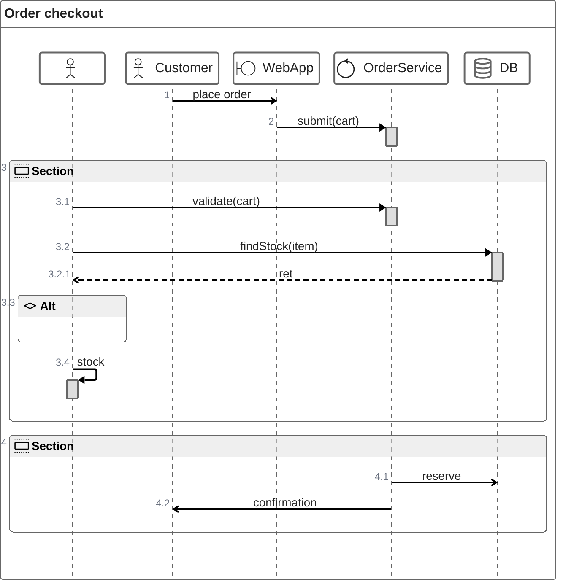

[Syntax Ref]: https://mermaid.ai/open-source/syntax/zenuml.html

# ZenUML

```mermaid
zenuml
title Order checkout

@Actor Customer
@Boundary WebApp
@Control OrderService
@Database DB

Customer->WebApp: place order
WebApp->OrderService.submit(cart) {
  OrderService.validate(cart)
  ret = DB.findStock(item)
  if (in stock) {
    OrderService->DB: reserve
    OrderService->Customer: confirmation
  } else {
    OrderService->Customer: out of stock
  }
}
```
